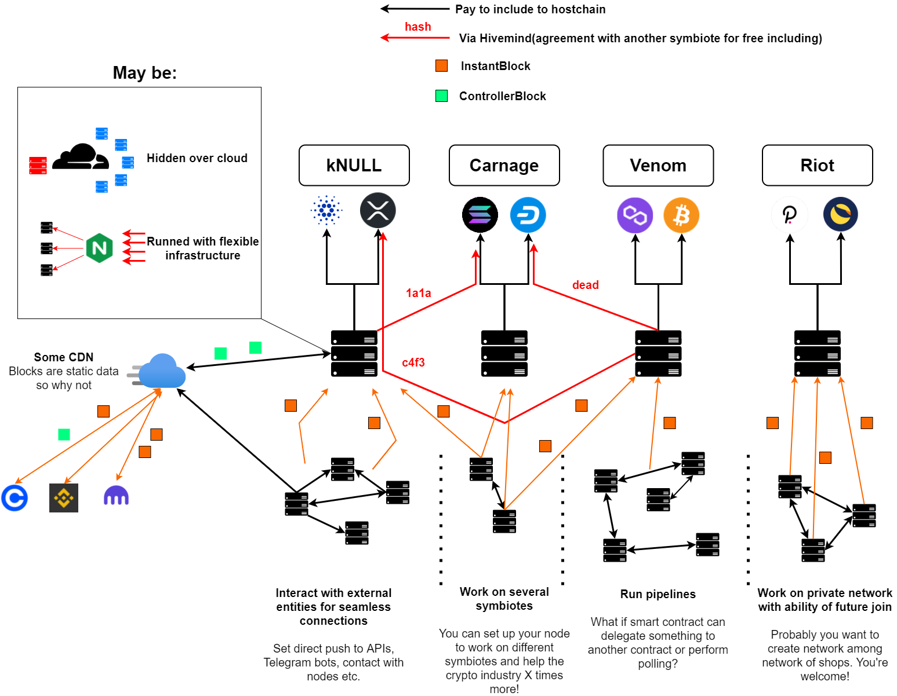
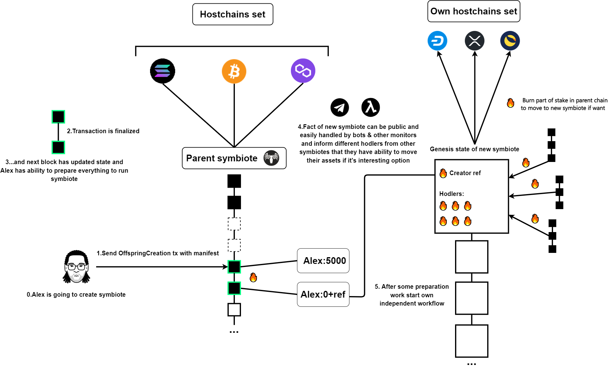

# 👽 Симбиоты

### <mark style="color:red;">Почему абстрактность важна</mark>

Мы строили KLYNTAR из соображений того как работает современный мир. Контейнерные перевозки, стандарты USB, маршрутизация трафика - всё это в мире взаимозаменяемое и одинаковое повсюду. Разрабатывая KLYNTAR мы не пытались "захардкодить" туда консенсус, менять который потом надо будет 8 лет, не пытались привязать жёсткое количество валидаторов или навязать какие-то жёсткие ограничения.

Именно поэтому, в основе архитектуры лежит принцип модульности когда каждый отдельный симбиот может строиться как конструктор, самостоятельно выбирая консенсус(обобщено в KLYNTAR под названием _<mark style="color:yellow;">**workflows**</mark>_ или рабочие процессы), набор хостчейнов, тип взаимодействия с ними, собственную комиссионную политику и так далее.

Несмотря на это, есть ряд "стандартных" и "общих" компонентов каждого симбиота. Так, к примеру стандартная реализация ядра KLYNTAR написанная на Node.js включает в себя некоторые общие элементы для всех симбиотов такие как:

* Реализация сервера
* Основной файл-запуска ([_<mark style="color:purple;">**klyn74r.js**</mark>_](https://github.com/KLYN74R/KlyntarCore/blob/main/klyn74r.js))
* Создание общих файлов и директорий(обычно конфигурационных)
* Установка слушателей сигналов SIGTERM, SIGINT, SIGHUP
* Создание некоторых общих глобальных переменных(например маппинг с приватными ключами или объект глобальной конфигурации)
* Запуск сервисов и плагинов
* ...и всё😅

Всё остальное - модульно настраиваемо и зависит от симбиота. Мы поговорим об этом детальней дальше на этой же странице.

### <mark style="color:red;">Что из себя представляет симбиот?</mark>


_<mark style="color:red;">**Симбиот**</mark>_ - это отдельная цепочка, которая имеет свой генезис, свою историю событий, свое состояние, работает следуя своим рабочим процессам(workflow) и взаимодействует со своим набором хостчейнов


### <mark style="color:red;">**Из чего состоит симбиот**</mark>

<mark style="color:orange;">**Workflow**</mark>

Первый и основной компонент каждого симбиота - это его рабочий процесс.


Мы постоянно указываем workflow потому что в русском сложно подобрать подходящий перевод


_<mark style="color:orange;">**Workflow**</mark>_ - это модель работы некоторого блокчейна. Тут определяется консенсус, определяется набор событий(разные транзакции, заморозки счёта, выполнение смарт-контрактов и т.д.), определяется набор маршрутов для сервера(для коммуникации нод между собой) и много другое. Давайте разбираться.

Workflow будут находится в директории KLY\_Workflows. Каждая сабдиректория будет репозиторием для отслеживания версий. Вы можете это увидеть на GitHub

 (1).png>)

Здесь вы видите 2 workflow - _<mark style="color:red;">**dev\_controller**</mark> и <mark style="color:red;">**dev**</mark>_<mark style="color:red;">**\_**</mark>_<mark style="color:red;">**symbiland**</mark>_

_<mark style="color:red;">**dev\_controller**</mark>_ представляет из себя централизованную версию рабочего процесса. Здесь 1 валидатор, однако блоки генерировать могут все у кого есть соответствующая ставка.

<mark style="color:yellow;">Пусть вас не пугает наличие 1 валидатора по нескольким причинам:</mark>

* Это удобно для локального тестирования и запуска тестнета
* Это максимально быстрый workflow ввиду отсутствия множества сторон. Симбиоты с таким workflow могут запускаться каким-то "достаточно доверенным лицом"(например биржей или какой-то организацией) следуя что-то типа модели Proof-of-Authority
* Главный валидатор всё равно не может отклонять транзакции(благодаря мутуализму и SpookyAction) или менять историю цепочки(благодаря хостчейнам и общему бюджету атаки)

_<mark style="color:red;">**dev\_symbiland**</mark>_ будет BFT блокчейном с использованием стейкинга(в том числе стейкинга с унобтаниумом), BLS мультиподписей и прочих интересных фич


В настоящее время все workflow находятся в разработке



Сейчас мы не вставляли сюда подмодули Git и поэтому вы не видите характерной иконки. Как говорилось ранее - к релизной версии может всё поменяться, но так же мы предполагаем что наиболее используемые workflow будут частью ядра, а не распространяться отдельно


Мы предполагаем наличие нескольких workflow, однако, ввиду понятий про "хорошие и быстрые блокчейны" будет только несколько основных которым будут пользоваться все. В целом, даже наше разделение на workflow с контроллером(_dev_\__controller)_ и на децентрализованный _dev\_symbiland_ уже выглядит достаточным_._

### <mark style="color:red;">**Так а что нового можно придумать?**</mark>

В этом и сила модульности рабочих процессов - вы можете придумать всё что угодно. К примеру, один симбиот будет запущен группой энтузиастов где будет BFT, а условный CoinBase - запустит свой симбиот где он будет представлять главного валидатора.

Можно построить гибридную схему где будет как централизующий фактор так и условные "голоса" группы валидаторов этого симбиота. Можно вынести часть логики на хостчейн. Так, к примеру, ваш симбиот может проверяться через контракты некоторого EVM блокчейна - по примеру пары Polygon-Ethereum или других L2 сетей.

Стройте что угодно)

### <mark style="color:red;">**Репозиторий с workflows**</mark>

На нашем GitHub есть соответствующий репозиторий куда разработчики могут публиковать свои workflow



Вскоре после старта проекта мы опубликуем инструкцию по написанию workflow и как публиковать это в репозиторий

### <mark style="color:red;">**Точка входа workflow на уровне кода**</mark>

Для большего понимания внутренней кухни поговорим про то, как начинается работа демона когда вы запускаете его

### <mark style="color:red;">**Как создаются новые симбиоты**</mark>

### <mark style="color:red;">**Про общие компоненты для симбиотов**</mark>

Как упоминалось ранее, есть ряд общих элементов для симбиотов

<mark style="color:yellow;">**Сервер**</mark>

.png>)



Вне зависимости от workflow
