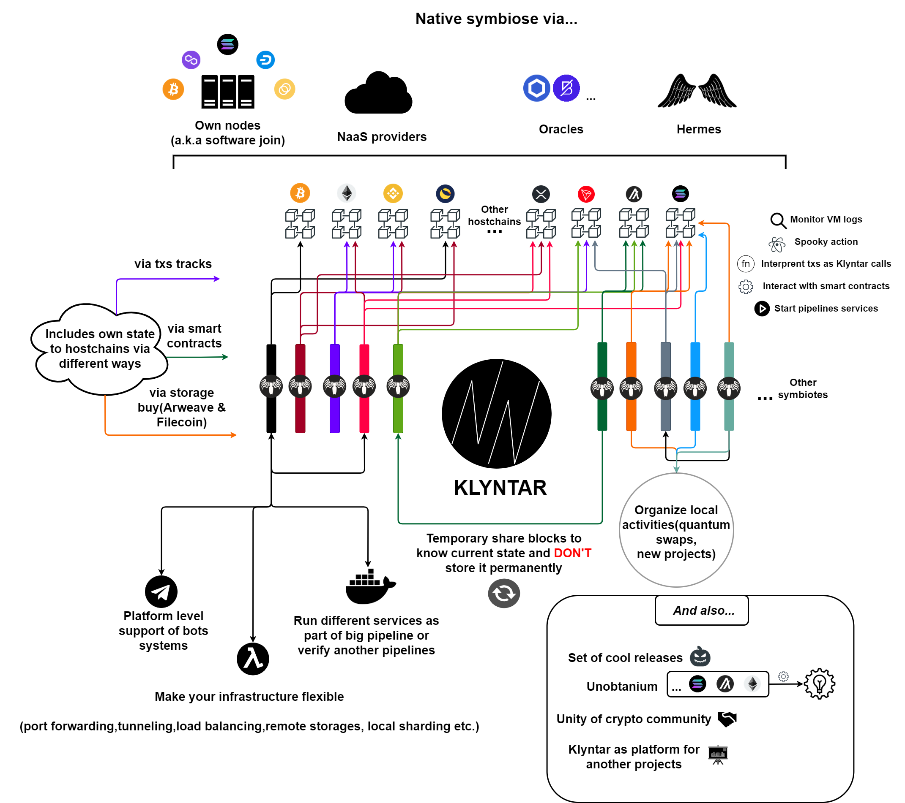

# ☕ В общем

### <mark style="color:red;">**Поговорим о структуре**</mark>

Работая над KLYNTAR, мы пытались сделать проект настолько мощным, чтобы удивить вас, как в 8 лет, когда вы узнали, что Деда Мороза не существует. Мы хотим воскресить время полезных проектов, создавая классные вещи для нашей отрасли, такие как Unobtanium, KLYNTAR Services, Hivemind, SpookyAction, симбиоты и многое другое!

Симбиоз с другими проектами (цепочками) даст вам возможность использовать лучшие и столь любимые функции других криптовалют. Смысл в том, чтобы объединить как новые блокчейны, так и старые в один супер организм и совершить революцию в криптоиндустрии! Общие ресурсы, разные консенсусы, майнеры BTC, держатели токенов ETH, валидаторы Solana, максимальная безопасность, основанная на безопасности всей криптоиндустрии —это все про KLYNTAR :)

Выше вы видите общую схему взятую из нашего whitepaper первой версии. В отличии от других крипто проектов, KLYNTAR не имеет какой-то главной цепочки, цепочки маяков или что-то в этом роде которая синхронизирует и чередует работу в шардах или координирует блокчейны (как Polkadot или Cosmos). Мы рассматриваем всё пространство блокчейнов как единую надёжную гомогенную среду.

KLYNTAR состоит из множества параллельных цепочек которые мы называем _<mark style="color:yellow;">**симбиоты**</mark>_(на схеме они представлены как параллельные разноцветные прямоугольники). Такое название они получили потому что вступают в симбиотическую связь с другими субъектами - _<mark style="color:yellow;">**хостчейнами**</mark>_(от слов host-носитель и chain-цепь, изображены в верхней части схемы). Эта связь необходима по многим причинам:

* <mark style="color:orange;">**Максимальная теоретическая безопасность**</mark>\
  \
  Что может быть безопасней всех крипто-проектов вместе взятых? Включая коммиты своего состояния в хостчейны, KLYNTAR гарантирует максимальную безопасность в плане неоткатности и финализации обновлённого состояния. Для взлома противнику теперь необходимо выкупить все активы PoS проектов, скооперировать всю майнинговую мощь PoW проектов, получить места валидаторов в разных цепочках где практикуется делегация. Мы не полагаемся только на Bitcoin или только на Ethereum. Мы не полагаемся на 21 валидатор и не боимся 5 майнинговых пулов. И так же мы не привязываемся к одной цепочке, будучи полностью зависимым от неё\

* <mark style="color:orange;">**Гибкость перемещения**</mark>\
  \
  Если на одной цепи станет дорого делать коммиты или обращаться к валидаторам для выполнения смарт-контракта то механизм мутаций позволяет легко сменить набор хостчейнов или рабочий процесс\

* <mark style="color:orange;">**Предварительно рассчитанный рациональный путь**</mark>\
  \
  Было бы нелогично если б у нас единая цепочка KLYNTAR линейно и тупо включала бы свои коммиты во все проекты. Это даже звучит страшно. Ведь надо тогда отслеживать все остальные цепочки + это было бы дорого и накладно.\
  \
  Однако, благодаря тому что у нас бесконечное множество параллельных симбиотов вы можете выбрать для запуска ноды или кластера один, два или несколько симбиотов для отслеживания и работы на нём. Симбиоты взаимодействуют между собой для включения коммитов своих состояний в большее количество сетей.\
  \
  Так один симбиот может делать коммиты в Bitcoin, Polygon и Solana, а второй - в XRP, Litecoin и Cardano. Они включают коммит друг друга в свой набор хостчейнов и каждый из них платит комиссию только в трёх сетях, однако в реальности на страже их безопасности теперь 6 хостчейнов. Это был простейший пример\

* <mark style="color:orange;">**Sharding-by-default**</mark>\
  \
  Фундаментальная концепция которая позволяет симбиотам работать параллельно и независимо друг от друга

### <mark style="color:red;">Больше про хостчейны</mark>

Зачем себя привязывать к одной цепи, если можно обезопасить сразу по максимуму причём используя разного рода гибкие схемы. С такой мыслью мы сидели когда планировали архитектуру и изучали документации других проектов. Нам известно и про принцип работы Polygon, разных L2 проектов на Ethereum, про RSK и даже про Stacks, но KLYNTAR это про другое.

Связываясь со многими цепочками, KLYNTAR приносит безопасность и для них за счёт того, что операторы узлов и кластеров KLYNTAR так же могут запускать узлы хостчейнов  и за счёт того, что мы рассчитываем на безопасность хостчейнов(а значит мы заинтересованы в их рыночной стоимости и развитии). Мы поговорим о рынке доверия далее и поверьте, даже если у вас сейчас есть запущенная инфраструктура других криптовалют - вы уже будете полезным на KLYNTAR и сможете получать здесь то что вам нужно.

### <mark style="color:red;">Больше про симбиоты</mark>

Если вы пока что не поняли, то нам удалось построить проект с высочайшим уровнем параллелизации благодаря архитектуре симбиотов. Здесь преимущество в том, что после первоначального симбиота kNULL'а который запустит наша команда и который будет точкой отсчёта KLYNTAR мы продолжим запускать других симбиотов. Таким образом, если на первоначальном симбиоте была высокая нагрузка и полностью забитые блоки, то открытие нового параллельного симбиота перенесёт часть транзакций и нагрузки на вторую цепь. Ввиду того, что новая цепь так же потребует бюджета безопасности, туда будет выгодно переезжать валидаторам первого симбиота. В качестве аналогии можете представить себе первооткрывателей некоторых материков - новые земли, новые возможности. Так же, это мотивирует часть пользователей перенести свои активы на параллельную цепь.

Этот процесс будет повторяться до бесконечности, а вместе с этим - и возможности, безопасность и масштабируемость.

<mark style="color:purple;">**Безопасность**</mark> - за счёт увеличения количества хостчейнов куда будет сохранено состояние KLYNTAR

<mark style="color:purple;">**Масштабируемость**</mark> - за счёт параллельной работы симбиотов

<mark style="color:purple;">**Возможности**</mark> - за счёт того, что новый симбиот привлечёт новых стейкеров, разработчиков и так далее

### <mark style="color:red;">Модульность</mark>

Изучив документацию дальше или взглянув на код на GitHub, вы сможете заметить что многие из директорий содержат подразделы

Так например директория для взаимодействия с хостчейнами выглядит так:

 (1).png>)

Директория с рабочими процессами:

 (1).png>)

Как можно заметить все они включают в себя несколько паков. Такая модульная структура позволяет одному симбиоту работать с использованием некоторого сценария консенсуса в режиме контроллера, а другому - следуя BFT коненсусу. Ну или же, например, выбрать пак для работы с хостчейнами.

Так же KLYNTAR будет доступен для расширения широкой экосистемой плагинов-от websocket серверов до кастомных механизмов логирования, от реверс-прокси сервера с фильтрами до Telegram бота. Вот кстати ещё одно доказательство модульности и независимости(директория с плагинами содержит отдельные репозитории)

&#x20;

.png>)

Узнайте больше про плагины [_<mark style="color:red;">**здесь**</mark>_](../plaginy.md)_<mark style="color:red;">****</mark>_

