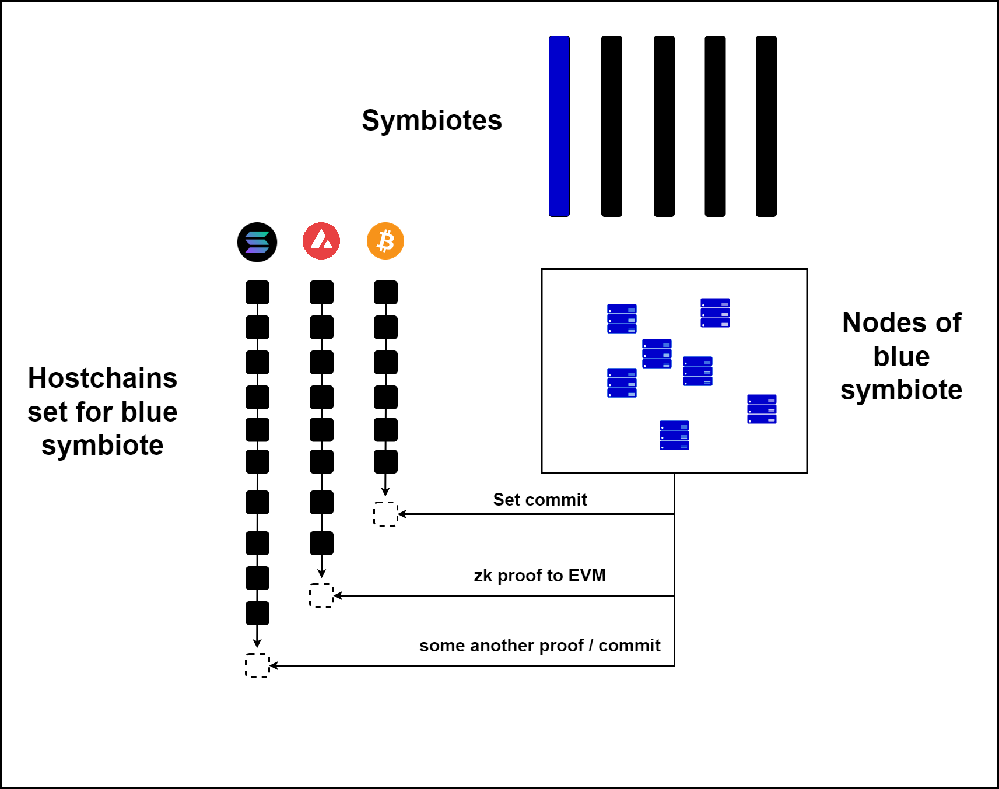
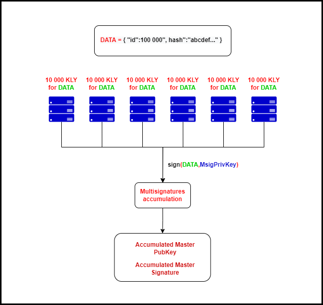

# 👨👩👦 Хостчейны

### <mark style="color:red;">Что считать хостчейном?</mark>

_<mark style="color:purple;">**Хостчейн**</mark>_ - это цепочка(блокчейн) на безопасность которого рассчитывают симбиоты. Можно сказать - это цепочка-носитель(host).

В зависимости от хостчейна и его возможностей(консенсус, наличие смарт-контрактов, безопасность) симбиоты вступают с ними в самые разные связи - от простого хранения коммитов(грубо говоря высота + хэш симбиота) до интерактива через смарт-контракты следуя логике которых невозможно будет провернуть зловредные действия.

Наилучшими хостчейнами можно считать те, которые имеют смарт-контракты. Это означает, что под них можно написать продвинутый коннектор который будет использовать этот смарт-контракт и выполнять нужную логику. Тем не менее, ввиду того, что любая цепочка общедоступная и открытая(permissionless), то можно использовать её SDK для построения коннекторов любой сложности и функционала.

### <mark style="color:red;">**PoW и PoS хостчейны. Преимущества и недостатки**</mark>

Мы перешли к важной теме. Ввиду того, что все хостчейны разные, все они используют разные алгоритмы консенсуса. Это важно для KLYNTAR так как речь идёт о том, что считать финализацией, можно ли в целом доверять этому хостчейну и так далее.

Спор между сторонниками PoS и PoW не угасает очень давно и каждый из них по своему прав. Но здесь речь пойдёт скорее не про классические PoW и PoS, а про две большие группы алгоритмов:

* Те которые тратят реальные ресурсы(через майнинг, траты памяти, времени)
* Те которые полагаются на внутреннюю стоимость своих монет(PoS и модификации, разные BFT и так далее)

Какие-то из них предлагают вероятностную завершенность, какие-то гарантируют моментальную финализацию.  Кроме того, часто сторонники PoS не любят упоминать про разного рода long range атаки(когда старые валидаторы создают форк с какой-то более ранней высоты блокчейна и вы теперь не можете знать какой из них валидный. При этом, слэшинг не работает, ведь старые валидаторы ничего не потеряют), хотя и у майнинга тоже есть свои проблемы. Некоторые(Zilliqa и другие), предлагают гибридный подход при котором PoW и PoS работают вместе.

Как бы там не было, симбиоту нужно выбрать такой набор хостчейнов, чтобы все риски были учтены и недостатки обоих групп консенсусов перекрывались преимуществами друг друга. Чтобы финализация проходила быстро, вам стоит выбрать быстрые хостчейны на основе BFT, а для долгосрочной безопасности стоит выбрать что-то из тяжёлой артиллерии - Bitcoin, майнинговые мощности других проектов, использовать комбинацию Proof-of-Space криптопроектов и так далее.

Благодаря тому, что определённая логика выполняется на workflow симбиотов, вам не стоит беспокоится о том, что связь с хостчейнами будет дорогой или подвергнется атаке.

К примеру, в наших workflow(рабочих процессах) запланировано делать так, что валидаторы удерживают ставку между коммитами в хостчейны. Таким образом между двумя интерактивами с хостчейном безопасность и неоткатность обеспечивается за счёт ставок валидаторов симбиотов, а после коммита - безопасность уже обеспечивают хостчейны.&#x20;

<mark style="color:yellow;">**Приведём наглядный пример**</mark>

Предположим, что ноды какого-то симбиота(тут выделено синим) начали сессию взаимодействия со своими хостчейнами и отправили необходимые данные на них(используя логику коннекторов). Пусть эти данные попадут и будут обработаны в будущие блоки хостчейна. В силу разных причин, каждый сам для себя принимает момент финализации(где-то вам достаточно что коммит был включён в Bitcoin, а где-то, что правильно отработали смарт-контракты).

С этого момента, это новая неоткатная точка в истории симбиота. Тут использованы как хостчейны на PoW(Bitcoin) так и на PoS / BFT (Solana и Avalanche). Состояние симбиота защищено как реально затраченными ресурсами, так и стоимостью виртуальных активов и ценностью сетей.

Тем не менее, для ускорения + удешевления таких взаимодействий, симбиот вазимодействует с хостчейнами с выбранной периодичностью - раз в час, раз в день и так далее. Чем дольше время между взаимодействиями - тем дольше валидаторы и те кто делал ставки не могут разблокировать свои ставки. Их монеты используются как залог безопасности.

Итак, в нашем примере выше взаимодействие происходит в новом блоке. Пусть это будут блоки A, B и C для Solana, Avalanche и Bitcoin соответственно.

Предположим, что это всё произошло для блока c индексом _<mark style="color:orange;">**100 000**</mark>_ и хэшем _<mark style="color:orange;">**adcdef...**</mark>_. В таком случае ноды подписывают эти данные и публикуют свои подписи.&#x20;

Мы здесь использовали мультиподписи с которыми вам предстоит познакомится [_<mark style="color:red;">**здесь**</mark>_](../kriptografiya/multi-porogovye-agregirovannye-podpisi.md), но пусть пока что для вас они будут неким чёрным ящиком который соберёт подписи и публичные ключи валидаторов и агрегирует их в единое доказательство.

Как мы видим выше, ноды подписали и теперь безопасность и неоткатность обеспечена:

* Хостчейнами
* Подписантами

В данном случае бюджет безопасности подписантов - 60 000 KLY, но в целом вы поняли что он будет больше. Более того, фичами workflow является так же то, что не только прямые валидаторы могут ставить на блок симбиота. Сторонним стейкерам даже необязательно знать что там внутри - их задача обеспечить существование единственной валидной цепочки.

<mark style="color:yellow;">**Что дальше?**</mark>\ <mark style="color:yellow;">****</mark>\ <mark style="color:yellow;">****</mark>Поскольку мы действуем эффективно, то с блока 100 000 до следующего дня(предположим что симбиот сохраняет данные в хостчейны раз в день) безопасность обеспечивается нодами симбиота и другими подписантами.

Они работают крайне быстро генерируя много блоков в секунду(спасибо фантомным блокам, о которых вы узнаете в следующем разделе) следуя правилам своего workflow.

Каждый блок подписывается аналогично тому, как было показано выше и пруф так же распространяется по сети.

На протяжении всего периода между коммитами в хостчейны ставки подписантов заморожены. Таким образом, их при необходимости можно подвергнуть слэшингу и при наличии доказательств того, что какой-то из валидаторов подписал другую версию блоков симбиота - лишить его ставки.

В нашем примере выходит так, что те кто заморозил ставки, не смогут их разморозить 1 день. Как только придёт время новой сессии взаимодействия, набор валидаторов может быть изменён. Вы, при необходимости разморозите свою ставку и уйдёте с заработанными процентами, а на ваше место могут быть ещё назначены другие подписанты.

### <mark style="color:red;">**Так же важное обращение к майнерам нынешних PoW проектов**</mark>

Не спешите выкидывать оборудование. KLYNTAR предоставит вам новые возможности️ 🧙‍♂

.png>)

### <mark style="color:red;">Hivemind</mark>

Hivemind - это будущее улучшения в KLYNTAR по работе с хостчейнами. Если коротко, то симбиоты будут обмениваться между собой данными и обеспечивать свою безопасность и безопасность других симбиотов путём замера времени генерации блоков в разных хостчейнах(для максимально быстрой финализации). Так же, это благоприятно скажется на тому, что взаимодействия с хостчейнами станет дешевле и быстрее.

### <mark style="color:red;">Методы взаимодействия с хостчейнами</mark>

Симбиоты взаимодействуют с хостчейнами используя коннекторы или же API. Подобное взаимодействие происходит как на уровне workflow так и на уровне сервисов(KLYNTAR Services).

Созревает вопрос

> Это значит, что мне надо будет запускать ноды хостчейнов???

Нет, не волнуйтесь, тут всё круче и интересней. Да, для взаимодействия с хостчейнами в рамках workflow и KLYNTAR Services вам нужно будет как-то связываться с другими блокчейнами.

Вот к примеру коннектор для EVM цепочек

.png>)



Видно, что здесь для Web3 модуля необходим адрес конечной точки. Аналогичное можно повстречать и в других коннекторах.

Здесь так - если у вас есть нода - используйте, иначе у вас целый спектр возможностей:

* Использования Node-as-a-Service сервисов
* Использовать общедоступные(но надёжные) ноды
* Использовать ноды которые могут сдаваться в аренду теми, у кого они есть

Так вы сможете быстро начать при этом не используя собственных ресурсов. Тем не менее, вам стоит быть осторожными - ведь если необходимо что-то подписать на KLYNTAR после проверки из хостчейна, то при ложных данных от зловредного источника вы рискуете потерять свои деньги.


Более детальную информацию мы опубликуем позже



Эта страница будет обновляться. Следите за обновлениями чтобы не пропустить ничего важного

