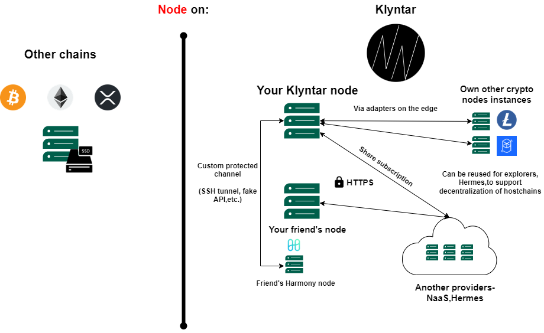
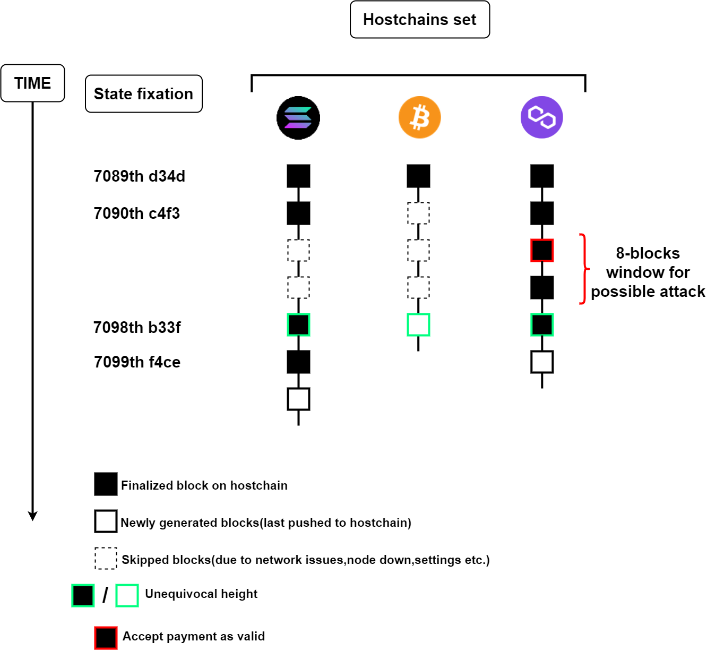

# 📄 Рабочие процессы(workflows)

### <mark style="color:red;">**Детальней про рабочие процессы**</mark>

Ранее мы говорили о том, что симбиоты могут самостоятельно создавать или использовать готовые шаблоны рабочих процессов.

Большая гибкость позволяет вам настроить внутри workflow разного рода необходимые взаимодействия - связь с API, использование коннекторов, общение с другими нодами и так далее. Так же здесь вам стоит решать другие проблемы - кэширование, обработка системных сигналов, хранение данных, генерация снепшотов, выбор валидаторов и другие проблемы характерные для блокчейнов.

Используйте всё что придумаете )

