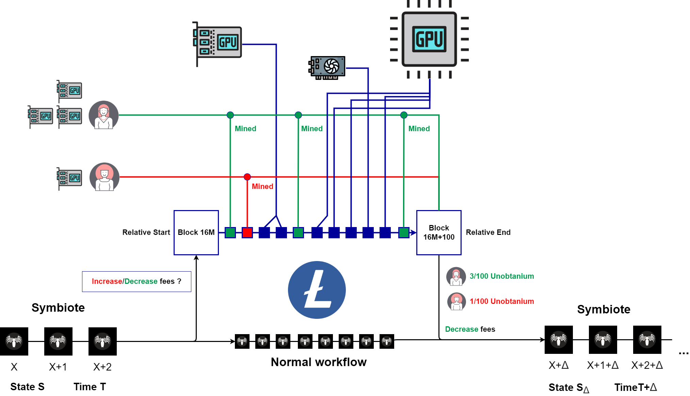
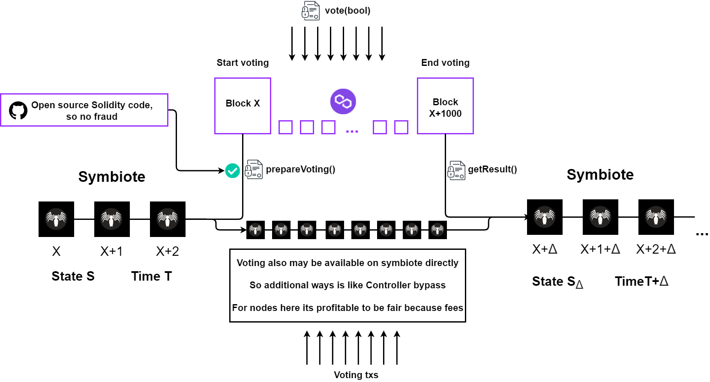

# 🏛 Социальный консенсус

### <mark style="color:red;">**Что это?**</mark>

Возможно вы видели подобное в других проектах, но мы хотим вывести механизмы социального консенсуса на новый уровень. Для начала определимся с терминологией


Социальный консенсус - публичное и финальное решение группы сторон относительно какого-то вопроса


В KLYNTAR используя интерфейс Apollo или же через сторонние сервисы вы сможете активно участвовать в жизни проекта. Это касается как принятие решений на любых уровнях

* <mark style="color:orange;">**Глобальный**</mark>\
  Общее голосование всех заинтересованных сторон в KLYNTAR - ходлеров KLY и токенов, валидаторов, держателей унобтаниума, майнеров и валидаторов хостчейнов, представителей KLYNTAR Services. Здесь будут решаться самые важные и глобальные вопросы касающиеся всей платформы
* <mark style="color:orange;">**Уровень симбиота/группы симбиотов**</mark>\
  Здесь принимают решения и имеют голос только те, кто имеют интересы и ресурсы на уровне симбиота. Это могут быть какие-то более приземлённые вопросы типа перенаправления части комиссий на финансирование чего-то(благотворительность, поддержка какой-то организации), смена workflow или набора хостчейнов и так далее.
* <mark style="color:orange;">**Уровень сервисов / смарт-контрактов**</mark>\
  Заинтересованные стороны получат возможность принимать голосования на уровне отдельных сервисов и смарт-контрактов. Тут речь идёт например про изменения исходного кода сервиса или другие локальные вопросы

Принимать голосования вы сможете прямо через Apollo в разделе _<mark style="color:purple;">**Разное**</mark>_(miscellaneous)

.png>)

### <mark style="color:red;">**Ресурсы хостчейнов в жизни KLYNTAR**</mark>

Мы ожидаем что в KLYNTAR при голосовании учитываться так же будут ресурсы хостчейнов. Ввиду того, что ваше оборудование работает на безопасность другой PoW криптовалюты, благодаря симбиозу так же получается что вы работаете и на нашу безопасность. Таким образом, можно будет проголосовать вашими Bitcoin блоками, объемом ставок в Avalanche или Solana, количеством запасов ликвидности ZCash которые ваши адреса поставляют на KLYNTAR и позволяют проводить квантовые свопы и другими ресурсами которые KLYNTAR будет считать ценными. К примеру, на схеме ниже показано как может быть рассчитано количество унобтаниума добытого для KLYNTAR путём майнинга Litecoin.

Тут для упрощения решается спор касательно комиссий на одном из симбиотов и участие принимают только 2 майнера. Разумеется это абстракция и количество сторон будет больше. Так, к примеру, здесь за 100 блоков было добыто условных 100 единиц унобтаниума, при этом 2 голосующих добыли всего 4 единицы из 100, тогда как "остальная сеть" - 96. Путём привязки своих адресов Litecoin к адресам BLS на KLYNTAR можно голосовать и подтверждать владение унобтаниумом.

Как упоминалось ранее - ввиду большей децентрализованности голосования так же могут проходить с использованием хостчейна. Таким образом, используя смарт-контракты так же можно будет принять участие в голосовании.

