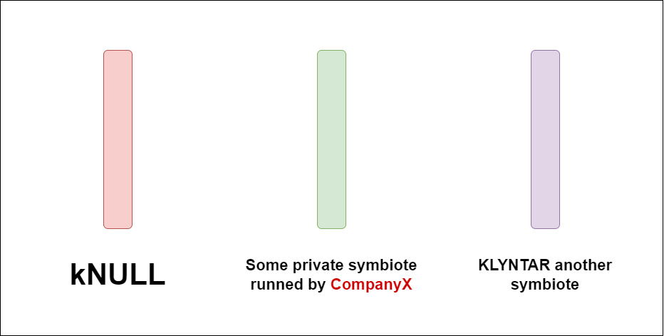
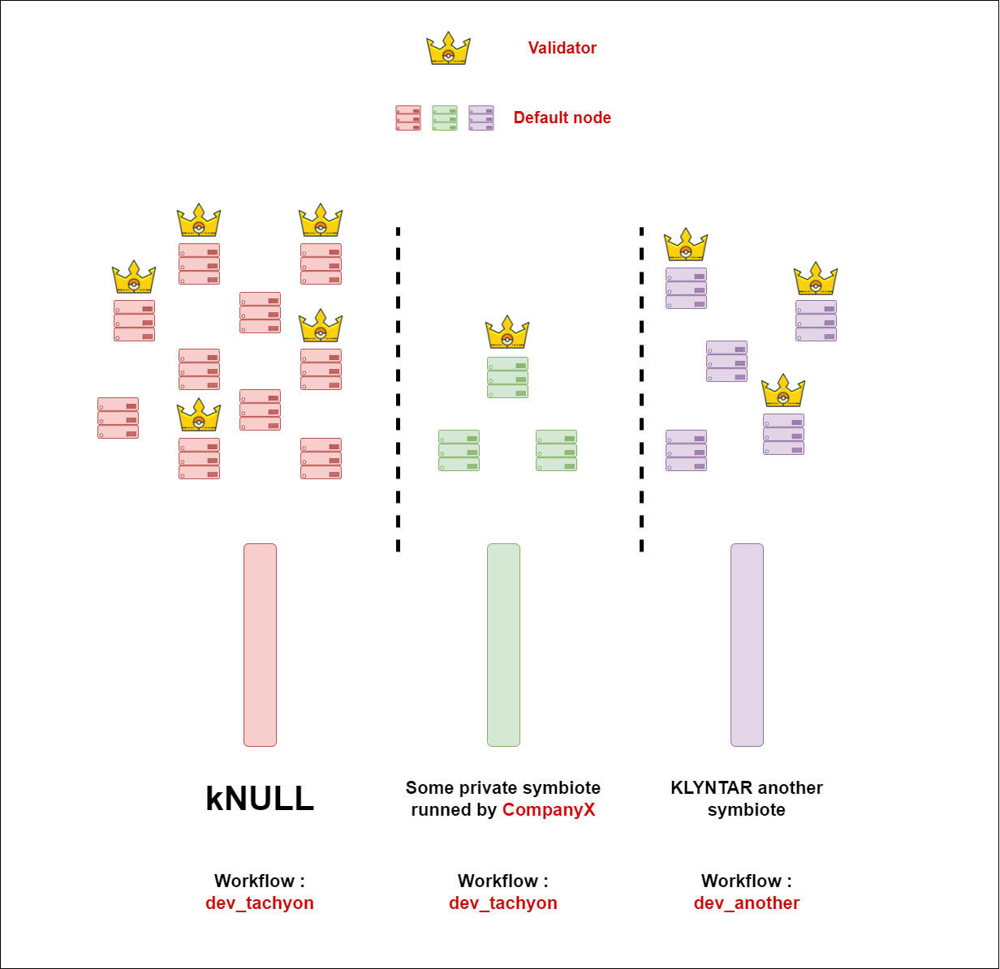
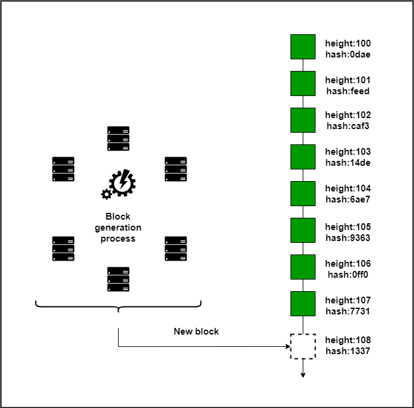
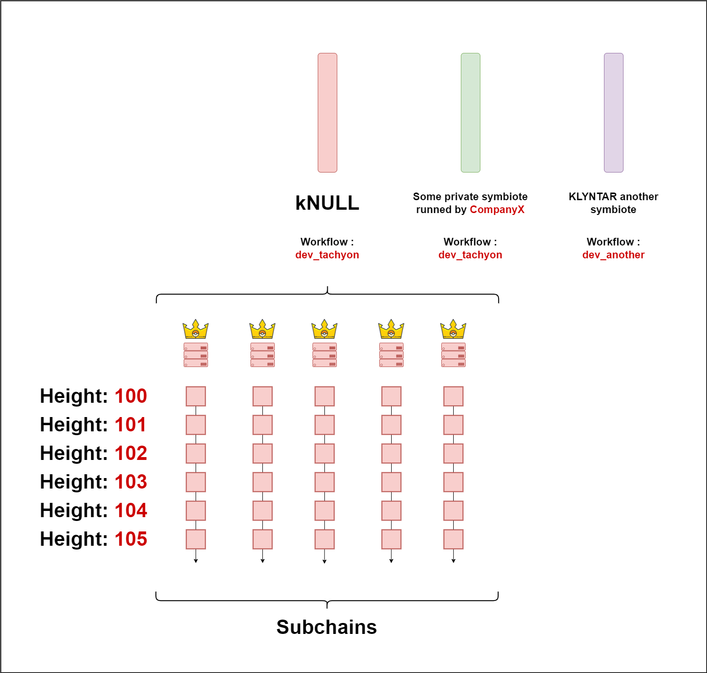
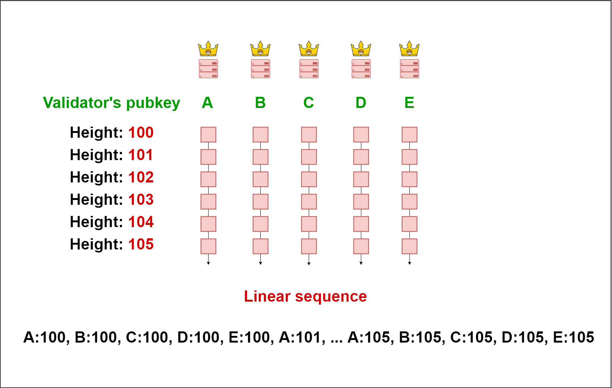

# 🫀 Тахион

### <mark style="color:red;">Предисловие</mark>

Механизм консенсуса - это фундамент на который опирается любая криптовалюта для достижения согласия относительно развития цепочки блоков, упорядочивания событий на цепи и для обеспечения дальнейшей безопасности сети.

В настоящее время, мир увидел много разных механизмов - от тотально разных(например PoW и PoS) до разного рода модификаций(модификации PoS в Cardano / Polkadot , разные BFT механизмы от и т.д.). Каждый из них стремится выполнить свои задачи, но всё же имеет и проблемы - долгая финализация, лимиты на количество валидаторов, ограничения времени генерации блока, долгое разрешение форков, время блокировки ставок и так далее.

Изучив много проектов и имея определённые наработки мы принялись создавать свой механизм который лёг бы в основу одного из workflow и который мог бы использоваться другими людьми и организациями которые хотели бы создать свой блокчейн или же одного из симбиотов в экосистеме KLYNTAR.

В процессе работы нам удалось создать молниеносный консенсус который может бесконечно масштабироваться и имеет много интересных фич. Нашей целью было создать реально фундаментальную вещь, а не просто слегка модифицировать ныне существующие решения.&#x20;

Таким образом, мы продумали такие вещи как:

* <mark style="color:orange;">**Рост количества валидаторов**</mark>\
  \
  Увеличение количества валидаторов должно увеличивать общесетевую скорость и безопасность. Никаких лимитов\

* <mark style="color:orange;">**Бюджет безопасности и использование хостчейнов**</mark>\
  \
  Безопасность симбиота для гарантии неоткатности должна полагаться не только на внутренние ставки и псевдофинализацию BFT, но и на хостчейны - Bitcoin, Ethereum, Solana и так далее. \

* <mark style="color:orange;">**Вынос части работы в оффчейн для бесконечной масштабируемости и легких модификаций**</mark>\
  \
  Это важная часть которая позволит вынести работу в оффчейн на уровень сервисов где можно будет ее распараллелить, ускорить с помощью оптимизаций, назначить больше валидаторов для выполнения этой работы. На симбиоте же будет один корневой BLS публичный мультисиг ключ который будет вмещать в себя всех валидаторов и проверять результаты работы для изменения состояния\
  &#x20;
* <mark style="color:orange;">**Асинхронность выполнения ончейн событий**</mark>\
  \
  Ончейн события должны выполнятся параллельно и максимально быстро\

* <mark style="color:orange;">**Мультипоточность**</mark>\
  \
  Валидаторы не работают над одной цепью, а генерируют собственную и включают ее в основную\

* <mark style="color:orange;">**Применение унобтаниума**</mark>\
  \
  Если вы уже майнер или валидатор других сетей, то вы сможете так же быть полезным и на KLYNTAR. Так же будет реализован стейкинг унобтаниума. Поэтому, случай когда безопасность сети от форков будет защищена 100 миллиардами долларов от Bitcoin майнеров или держателей \

* <mark style="color:orange;">**Применение плагинов**</mark>\
  \
  Плагины способны позитивно повлиять на все процессы. Это, к примеру, запущенный на localhost websocket-сервер который более быстро обменивается блоками, транзакциями и помещает их прямо в ваш мемпул или хранилище благодаря тому, что запущен в том же процессе, это разного рода лёгкие клиенты которые выполняют фильтрацию на фоне и так далее. Мы обязательно вернёмся к этой теме позже

\
Теперь познакомимся более детально для того, чтобы понять все преимущества и понять как это работает. Пройдём от общего описания до фрагментов кода для большего погружения в происходящее.

### <mark style="color:red;">Имплементация консенсуса на уровне кода</mark>


Тахион является BFT консенсусом с набором валидаторов нескольких уровней, ставками и стейкингом(в KLY и унобтаниуме) который реализован в рабочем процессе _<mark style="color:red;">**dev\_tachyon**</mark>_.


Вы можете увидеть реализацию здесь - в директории _<mark style="color:yellow;">**KLY\_Workflows/dev\_tachyon**</mark>_

<figure><figcaption></figcaption></figure>



### <mark style="color:red;">**Введение**</mark>

Во избежание путаницы, повторим архитектуру KLYNTAR

<figure><figcaption></figcaption></figure>

Вы могли видеть эту схему ранее, но сейчас необходимо визуализировать KLYNTAR от общей структуры на верхнем уровне и до уровня одного симбиота. Так будет легче понять и описать происходящее.

Прямоугольные разноцветные блоки - это и есть симбиоты.

<figure><figcaption></figcaption></figure>

_<mark style="color:purple;">**Симбиоты**</mark>_ - это отдельные блокчейны в экосистеме KLYNTAR. Они могут быть запущены как нашей командой и сообществом так и сторонними организациями и командами которые хотят создать свой блокчейн(к примеру, приватный или полу-приватный).


Простой пример - первый симбиот на основе рабочего процесса dev\_tachyon который будет запущен нами и за которым зарезервирован алиас kNULL


<mark style="color:orange;">**Зачем нам создавать ещё один блокчейн?**</mark>

Это необходимо будет для снижения нагрузки на другие симбиоты. Поскольку они независимы, то вы сможете динамически выделять ресурсы под определённые симбиоты и параллельно запускать ноды. Это позитивно сказывается на облегчении порога входа.

Давайте визуализируем это на простом примере. Допустим на KLYNTAR уже работают 3 симбиота - один основной kNULL, какой-то приватный блокчейн некой компании X и ещё один симбиот запущенный нашей командой спустя год после запуска kNULL.

<figure><figcaption></figcaption></figure>

Теперь предположим что вы хотите запустить ноду, валидатора или же просто отслеживать какую-то из цепей.

Обычно в других проектах вас ставят перед фактом - вам нужен сервер на 32 ГБ ОЗУ, SSD на 2 ТБ и ещё какие-то рекомендации, к примеру, на ширину канала.

Предположим, что симбиот kNULL имеет много пользователей и высокий трафик(например кол-во транзакций в день), что может быть слишком дорого для вас. В таком случае, вы сможете запустить ноду на другом симбиоте который менее "прожорлив"(в нашем примере - это фиолетовый симбиот). Таким образом, даже не обладая мощным оборудованием вы сможете быть полезным для сети. Подобное горизонтальное масштабирование с каждым новым симбиотом будет облегчать работу всех ранее созданных симбиотов. Это значит, что безопасность и масштабируемость будут только расти. И да, вы правильно поняли - это похоже на шардинг за тем лишь исключением что каждый симбиот - это отдельный блокчейн.

Что касается симбиота который запущен CompanyX, то об этом проговорим в следующем разделе

<mark style="color:orange;">**Зачем сторонним разработчикам создавать свой блокчейн в экосистеме KLYNTAR**</mark>

В нашем примере, некая компания CompanyX решила запустить свой симбиот для каких-то своих нужд в экосистеме KLYNTAR. На основе уже созданных модулей и workflow можно будет легко "собрать" блокчейн для своих нужд и сделать его частью KLYNTAR(или же самостоятельным блокчейном вне KLYNTAR)

_<mark style="color:yellow;">**Какие-же преимущества получит**</mark>** **<mark style="color:red;">**CompanyX**</mark>** **<mark style="color:yellow;">**?**</mark>_

* <mark style="color:orange;">**Созданный блокчейн может быть запущен сразу на всех узлах сети KLYNTAR**</mark>\
  \
  Вы получаете "аудиторию" фактически сразу после того, как ваш блокчейн будет готов. Сеть будет состоять из узлов которые запустили программное обеспечение узла вашего блокчейна, к примеру, в Docker контейнере или же в облаке. Также, вы можете отдельно мотивировать участников или же назначать только своих валидаторов для своего симбиота.\



Это <mark style="color:red;">**НЕ**</mark> значит что KLYNTAR будет заполнен разными "шиткоин" блокчейнами. По крайней мере, будет проводиться определённый обзор предлагаемых кандидатов-вы получите уведомление в Apollo, в своем Telegram или Discord. Если это интересный проект, то он быстро станет частью KLYNTAR. Вам достаточно будет нажать условную "одну кнопку" чтобы развернуть новый проект в вашей инфраструктуре.\
\
Но и переживать не стоит - отбор не слишком строгий и будет +- такой же как и деплой контракта в Ethereum, достаточно чтобы проект был многообещающим или же просто приносил выгоду тем кто запускает ноды.


* <mark style="color:orange;">**Такой блокчейн получает преимущества от KLYNTAR**</mark>\
  \
  К примеру, ваш симбиот сможет проводить бесплатные квантовые свопы с другими симбиотами, полагаться на безопасность KLYNTAR и так далее. Представьте если бы между Ethereum и Cardano существовала договорённость по бесплатным переводам. В таком случае мосты не нужны были бы и вы смогли бы менять свои ETH на ADA.\
  \
  Простыми словами, запустить свой блокчейн на KLYNTAR равносильно вступлению страны в какой-то торгово-экономический или военный союз. Вы получаете преимущества и в тоже время приносите пользу всему союзу.\

* <mark style="color:orange;">**Доступ к хостчейнам и сервисам**</mark>\
  \
  Такой симбиот будет иметь доступ к хостчейнам - иметь доступ к API Bitcoin, взаимодействовать с смарт-контрактами Polygon и так далее.


Вы можете думать про симбиоты как про процессы в операционных системах - они независимы и не разделяют память, но могут взаимодействовать между собой. Подобно тому, как процессы запускаются в ОС и работают на машине(сервер или ваш ноутбук), так и симбиоты работают в большой машине KLYNTAR.

### <mark style="color:red;">Рассматриваем консенсус на уровне одного симбиота</mark>

Отлично, теперь переходим от архитектуры всей сети и множества симбиотов на уровень одного симбиота.

Каждый симбиот имеет свой workflow в котором реализован консенсус и остальная логика работы цепочки - прием транзакций, кэширование, взаимодействие между узлами и так далее. Каждый симбиот имеет группу узлов подобно другим блокчейн проектам.

Визуализируем для понимания

<figure><figcaption></figcaption></figure>

Далее для описания механизма консенсуса будет рассмотрен только kNULL

### <mark style="color:red;">**Чем больше, тем лучше и минимализм коммуникаций**</mark>

В других блокчейнах вы привыкли видеть подобную цепочку блоков над заполнением которой работают все валидаторы / майнеры

<figure><figcaption></figcaption></figure>

Однако, мы не пошли таким путём. Мы поняли, что можно избавиться от лишних коммуникаций и синхронизаций если каждый валидатор будет работать над собственной "подцепочкой"(subchain) вместо того, чтобы все валидаторы работали над одной. При такой структуре, валидатор уже после запуска начинает генерировать блоки моментально без необходимости синхронизации с другими валидаторами.

<figure><figcaption></figcaption></figure>

На этом изображении можно провести ещё одну аналогию.


Симбиоты, как упоминалось ранее - это процессы в операционной системе. Они не разделяют память и работают независимо. Это отдельные блокчейны.\


Сабчейны - это потоки внутри процесса. Каждый блок каждого сабчейна меняет общее состояние симбиота. Каждый валидатор и узел который работает на симбиоте будет иметь одинаковые блоки и состояние


Ну и вот наглядное соответствие

<figure><figcaption></figcaption></figure>

В таком случае, в блокчейне где будет 100 валидаторов и каждый из них будет генерировать 1 блок в 2 секунды(что сегодня является нормальной практикой), мы фактически будем получать 50 блоков в секунду(что равно 1 блоку в 20 миллисекунд)

На уровне сабчейна каждый блок включает в себя хэш предыдущего блока в сабчейне для формирования цепочки, но никак не какой-то другой хэш. Аналогично, индексация происходит согласно порядку в сабчейне. Но как же различать блоки? Там где в обычных блокчейнах блок идентифицируется по хэшу или индексу, в KLYNTAR так же добавляется публичный ключ валидатора. Таким образом, для поиска блока по индексу надо указывать такой ID

<mark style="color:red;">**\<BLS мультисиг публичный ключ валидатора>**</mark>:<mark style="color:orange;">**<высота блока>**</mark>

Это даже можно увидеть в логах узла валидатора

<figure><figcaption><p>Здесь видно как узел пытается найти блок <em><mark style="color:yellow;"><strong>7Wnx41FLF6Pp2vEeigTtrU5194LTyQ9uVq4xe48XZScxpaRjkjSi8oPbQcUVC2LYUT:</strong></mark><mark style="color:orange;"><strong>1721</strong></mark></em></p></figcaption></figure>

### <mark style="color:red;">Валидация и формирование последовательности проверки</mark>

Казалось бы, круто что теперь с каждым новым валидатором будет расти и скорость генерации блоков, но нам же ещё надо эти блоки проверять и чередовать.

Здесь на помощь приходит список валидаторов в генезисе, детерминизм и возможность облачного масштабирования.

Так же, необходимо на этом этапе решить что считать финализацией и "проверкой" блока, ведь это не очень понятно при такой структуре. К тому же, показатель TPS(Transactions per second) можно вывести только на основе времени финализации.

Итак, обычно принято считать что блоки обрабатываются последовательно - сначала блок с индексом 100, потом 101, затем 102 и так далее. Это работает в случае с единой цепочкой, но в нашем случае - всё по другому. В KLYNTAR блоки "проверяются" нодами по уровням.

Сначала обрабатываются все блоки с индексом 0 всех валидаторов, потом блоки с индексом 1 и так далее. Вот как можно это визуализировать и перенести в линейную плоскость

<figure><figcaption></figcaption></figure>

Порядок определяется генезис-состоянием, а так же дальнейшим развитием последовательности блоков. К примеру, вот шаблон генезиса для dev\_tachyon из GitHub

```json
{
    "ACCOUNTS":{

        "7GPupbq1vtKUgaqVeHiDbEJcxS7sSjwPnbht4eRaDBAEJv8ZKHNCSu2Am3CuWnHjta":{
            "B":200000,
            "T":"A",
            "N":0
        },

        "7Wnx41FLF6Pp2vEeigTtrU5194LTyQ9uVq4xe48XZScxpaRjkjSi8oPbQcUVC2LYUT":{
            "B":200000,
            "T":"A",
            "N":0
        },

        "7fJo5sUy3pQBaFrVGHyQA2Nqz2APpd7ZBzvoXSHWTid5CJcqskQuc428fkWqunDuDu":{
            "B":200000,
            "T":"A",
            "N":0
        }

    },

    "VALIDATORS":[
        "7GPupbq1vtKUgaqVeHiDbEJcxS7sSjwPnbht4eRaDBAEJv8ZKHNCSu2Am3CuWnHjta",
        "7Wnx41FLF6Pp2vEeigTtrU5194LTyQ9uVq4xe48XZScxpaRjkjSi8oPbQcUVC2LYUT",
        "7fJo5sUy3pQBaFrVGHyQA2Nqz2APpd7ZBzvoXSHWTid5CJcqskQuc428fkWqunDuDu"
    ]

}
```

Здесь в массиве VALIDATORS указан список валидаторов и их порядок - следуя ему и будут обрабатываться блоки.

Однако, это лишь первичная установка в генезисе. На деле же, в процессе развития симбиота будут добавляться и удалятся валидаторы, а так же надо учесть тот факт, что валидаторы могут быть оффлайн или же отключены для проведения обновлений или чего-то ещё.

Мы вернёмся к этим вопросам после того, как узнаем как происходит финализация блока и почему в KLYNTAR она будет такой быстрой.

### <mark style="color:red;">Финализация</mark>

Для BFT блокчейнов характерным является такой принцип - валидатор замораживает ставку и вместе с другими валидаторами формирует цепочку блоков. Поскольку при нечестном поведении(к примеру, создание форка) он потеряет свою ставку, то он вынужден играть честно. Так же, ещё одна особенность таких блокчейнов - следование большинству. Обычно речь идёт про _<mark style="color:red;">**2/3\*N+1**</mark>_ голосов где _<mark style="color:red;">**N**</mark>_ - количество валидаторов в сети.


Итак, в KLYNTAR блок будет обработан нодой только в случае получения подтверждения от _<mark style="color:red;">**2/3\*N+1**</mark>_ валидаторов


Валидатор генерирует пруф на блок(подписывает его ID и хэш) только после того, как получил его. Затем, этот пруф распространяется по сети вместе с пруфами от других валидаторов. Когда подходит время непосредственной проверки блока(когда узел выполняет транзакции из блока), то он проверяет свой кэш для пруфов и если оказывается что уже как минимум _<mark style="color:red;">**2/3\*N+1**</mark>_ валидаторов тоже готовы принять этот блок, то он агрегирует эти доказательства благодаря возможностям мультиподписи и формирует агрегированное доказательство и затем проверяет блок.

Давайте попробуем пройтись шаг за шагом

Представим что у нас в сети 3 валидатора. Каждый из них имеет свой BLS ключ и генерирует блоки в своем сабчейне

```json
"VALIDATORS":[
        "7GPupbq1vtKUgaqVeHiDbEJcxS7sSjwPnbht4eRaDBAEJv8ZKHNCSu2Am3CuWnHjta",
        "7Wnx41FLF6Pp2vEeigTtrU5194LTyQ9uVq4xe48XZScxpaRjkjSi8oPbQcUVC2LYUT",
        "7fJo5sUy3pQBaFrVGHyQA2Nqz2APpd7ZBzvoXSHWTid5CJcqskQuc428fkWqunDuDu"
    ]
```

Предположим, что валидатор _<mark style="color:red;">**7GPupbq1vtKUgaqVeHiDbEJcxS7sSjwPnbht4eRaDBAEJv8ZKHNCSu2Am3CuWnHjta**</mark>_ сгенерировал блок _<mark style="color:orange;">**1337**</mark>_ и готовится распространить его по сети. Сперва, он генерирует доказательство принятия для самого себя - он ведь один из валидаторов.

Ранее его кэш для пруфов имел такой вид

```json
{
    "7Wnx41FLF6Pp2vEeigTtrU5194LTyQ9uVq4xe48XZScxpaRjkjSi8oPbQcUVC2LYUT:X":{
    
        "V":{
            
            "7GPupbq1vtKUgaqVeHiDbEJcxS7sSjwPnbht4eRaDBAEJv8ZKHNCSu2Am3CuWnHjta":"jfgz4ETT5y5tqy4qNpgANcWcjDJxQmOGxVrRc+nnVmGoKn7DaQy5uDF/KlHxR0PHAI7q5Twh2eXoGC1/0cVpD5ZH/FPupkJ0omJ81F0Ure9NAQrLu1GDHUHlo+VkFNTe",
            "7Wnx41FLF6Pp2vEeigTtrU5194LTyQ9uVq4xe48XZScxpaRjkjSi8oPbQcUVC2LYUT":"teC7C0I745bpMxMhfqxCEeQWoxWqCtX7wT1JA/VHcsWjGRK/6uwS8nTXqPiyGE02E1dMGx24+p3Fs+t5Sa1AG29x2HwM8491q858HivzGNZubs5Bnbso06lfkkdoKhTR"
            
        }
        ,...
}
```

Сюда добавляются доказательства принятия от других валидаторов. После того как блок 1337 будет добавлен - кэш будет иметь такой вид

```json
{
    "7Wnx41FLF6Pp2vEeigTtrU5194LTyQ9uVq4xe48XZScxpaRjkjSi8oPbQcUVC2LYUT:X":{
    
        "V":{
            
            "7GPupbq1vtKUgaqVeHiDbEJcxS7sSjwPnbht4eRaDBAEJv8ZKHNCSu2Am3CuWnHjta":"jfgz4ETT5y5tqy4qNpgANcWcjDJxQmOGxVrRc+nnVmGoKn7DaQy5uDF/KlHxR0PHAI7q5Twh2eXoGC1/0cVpD5ZH/FPupkJ0omJ81F0Ure9NAQrLu1GDHUHlo+VkFNTe",
            "7Wnx41FLF6Pp2vEeigTtrU5194LTyQ9uVq4xe48XZScxpaRjkjSi8oPbQcUVC2LYUT":"teC7C0I745bpMxMhfqxCEeQWoxWqCtX7wT1JA/VHcsWjGRK/6uwS8nTXqPiyGE02E1dMGx24+p3Fs+t5Sa1AG29x2HwM8491q858HivzGNZubs5Bnbso06lfkkdoKhTR"
            
        }
        ,
        
    //    ...(other proofs)
    
    // Proofs for block 1337 by 7GPupbq1vtKUgaqVeHiDbEJcxS7sSjwPnbht4eRaDBAEJv8ZKHNCSu2Am3CuWnHjta
    "7GPupbq1vtKUgaqVeHiDbEJcxS7sSjwPnbht4eRaDBAEJv8ZKHNCSu2Am3CuWnHjta:1337":{
    
        "V":{
            
            "7GPupbq1vtKUgaqVeHiDbEJcxS7sSjwPnbht4eRaDBAEJv8ZKHNCSu2Am3CuWnHjta":"rJXZWtb4OB7l3s5jnahhILeJVFzgislkEssx0I2Eud9dsUFQJrfJMY2o7aBxK20lAWuMA79aPvPNV4VOtT1pBCzOHOEq119+9LjfmQNPk7RUodaYXdE1cqflA5Kb6cxp"
        
        }    

}
```

Подпись генерируется следующим образом

```javascript
let signature = await SIG(blockID+":"+hash)

// If block 1337 by validator
// 7GPupbq1vtKUgaqVeHiDbEJcxS7sSjwPnbht4eRaDBAEJv8ZKHNCSu2Am3CuWnHjta
// has the hash 0123456789abcdef... then the signature will be like this one

let signa = await SIG('7GPupbq1vtKUgaqVeHiDbEJcxS7sSjwPnbht4eRaDBAEJv8ZKHNCSu2Am3CuWnHjta:1337:0123456789abcdef...')
```

Аналогичную работу проводят и другие валидаторы и распространяют свои пруфы принятия блока по сети.

_<mark style="color:yellow;">**Здесь мы и получаем свой ответ**</mark>_


Блок считается финализированным если за него проголосовали _<mark style="color:red;">**2/3\*N+1**</mark>_ валидаторов


Таким образом, разного рода стороннее ПО, кошельки, биржи, обозреватели и так далее могут считать что блок принят, если за него проголосовало нужное количество валидаторов и вы получили криптографические доказательства этому.

Даже если ваша нода проверяет только 1000ый блок другого сабчейна(допустим _<mark style="color:orange;">**7Wnx41FLF6Pp2vEeigTtrU5194LTyQ9uVq4xe48XZScxpaRjkjSi8oPbQcUVC2LYUT**</mark>_), то имея пруфы к этому блоку 1337 сабчейна _<mark style="color:orange;">**7GPupbq1vtKUgaqVeHiDbEJcxS7sSjwPnbht4eRaDBAEJv8ZKHNCSu2Am3CuWnHjta**</mark>_, уже можно считать его финализированным и тем, который 100% будет обработан когда ноды дойдут до него.

### <mark style="color:red;">Ответы на несколько вопросов которые наверняка возникли к этому времени</mark>

1. <mark style="color:yellow;">**Q**</mark>**: **<mark style="color:red;">****</mark> Так а что если в блоке будут неправильные транзакции - с ложным nonce, те которые тратят больше чем имеют и так далее\
   \
   <mark style="color:yellow;">**A**</mark>: В нашем случае нам важно только утвердить последовательность, а не валидность каждой из транзакции внутри. В любом случае, если все узлы начинают с генезис-состояния S которое одинаковое для всех, то пройдя через одинаковую последовательность блоков, у них у всех будет состояние S1.\

2.

### <mark style="color:red;">Какие ещё фишки в Tachyon</mark>

Ранее мы уже рассказывали и намекали на использования мощности и скорости других цепочек таких как Solana или TON.

### <mark style="color:red;">Пару слов про гибкость конфигураций</mark>

Подобно нашему прошлому рабочему процессу _<mark style="color:red;">**dev\_controller**</mark> _ на основе которого и создан _ <mark style="color:red;">**dev\_tachyon**</mark>,_ здесь также присутствует большое дерево конфигураций



Если вы будете запускать собственный блокчейн(на KLYTNAR или же просто свой приватный), то вы получите возможность гибкой настройки времени генерации блока, набора хостчейнов, приостанавливать или запускать генерацию/проверку блоков, настраивать интервалы времени для проверки прогресса, манипулировать доступными маршрутами сервера и так далее.

Всё это сделано для того, чтобы вы смогли настраивать всё под себя. Мы надеемся что в экосистеме KLYNTAR будет создано много блокчейнов которые откроют для себя всю мощь и возможности KLYNTAR 😊
