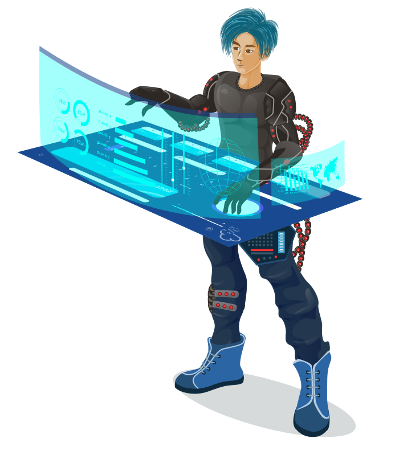

# ℹ Введение

### <mark style="color:red;">**Начало**</mark>

Сегодня необходимость смарт-контрактов в блокчейнах фактически обязательная, ведь позволяет писать кастомную логику в виде контрактов которые потом живут и выполняются в децентрализованной среде.

В KLYNTAR мы старались быть максимально универсальными для того, чтоб позволить вам легко и быстро начать писать что-либо для KLYNTAR. Вы сможете писать на любом языке который вы хорошо знаете и который компилируется в WASM модули, а так же использовать расширенные возможности такие как запросы в сеть или хранения больших данных "вне блокчейна" симбиота которые могут быть запрошены для выполнения некоторой функции и многое другое.

.png>)



