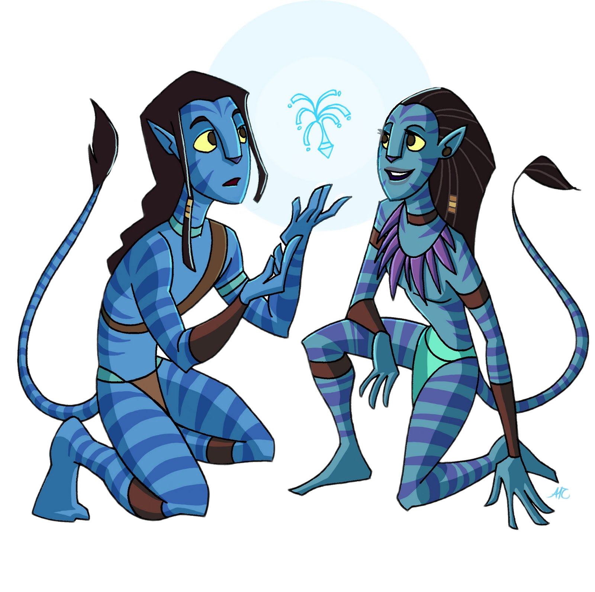

# 🛰 Pandora


Статус - <mark style="color:purple;">**Планирование и проектирование**</mark>


Пандора — планета из фильма «Аватар», на которой живет раса На’ви и где человечество добывает Унобтаниум. Мы согласны с тем, что этот релиз будет самым ценным, потому что он принесет рынок Унобтаниума в KLYNTAR. Проще говоря, представьте, что есть два майнера — майнер Dash и майнер Bitcoin. Оба сгенерировали по 10 блоков и хотят утвердить это на KLYNTAR, чтобы получить Unobtanium( и таким образом увеличить свое влияние). Однозначно мы не можем их приравнять, потому что это разные цены, сложности и так далее. И как оценить совершенно разные источники Unobtanium, такие как 10 000 Matic и ваше место в качестве валидатора на Binance Smart Chain? Поэтому, чтобы справиться с этим, нам нужно такое обновление

