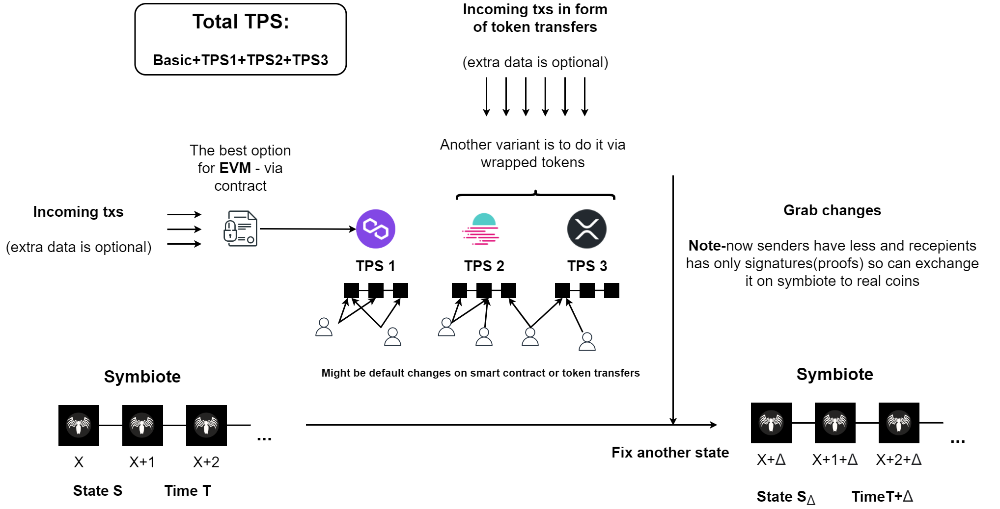

# ☄ SpookyAction

Одно из самых важных обновлений для KLYNTAR. В квантовой механике призрачное действие было названо Эйнштейном для описания взаимодействия между запутанными частицами на расстоянии. Из-за корреляции между частицами (например, фотонами, позитронами и т.д.) он не мог объяснить, как информация между ними может передаваться даже через миллиарды световых лет мгновенно. Хотя это невозможно и ученые нашли этому объяснение, мы позаимствовали несколько фундаментальных столпов — «на расстоянии» и «мгновенно».

<mark style="color:yellow;">**Мгновенно**</mark>

Предоставление возможности проведения операций в других цепочках также может быть полезно для увеличения TPS.
