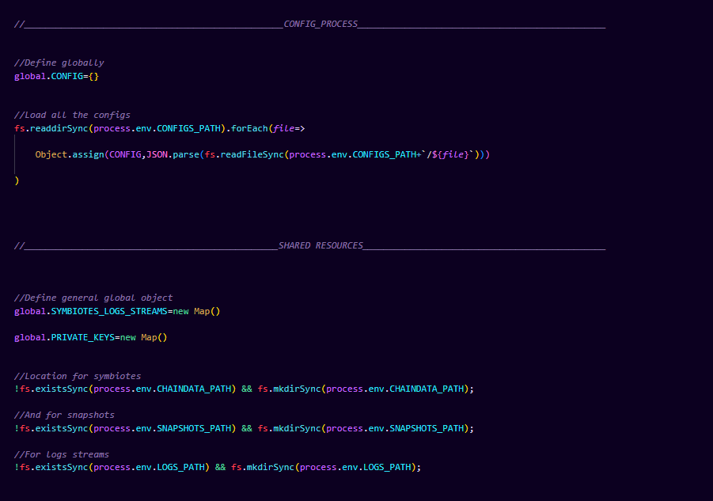
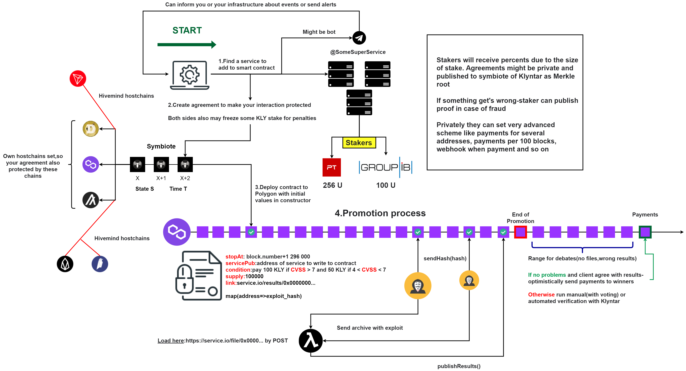
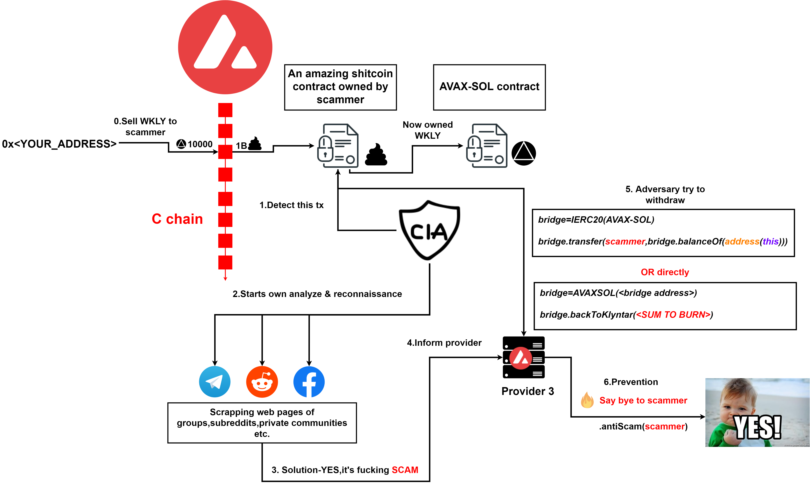

# 🤩 Интро

### <mark style="color:red;">**Точка отсчёта**</mark>

Долгое время проекты криптоиндустрии позволяли выполнять смарт-контракты в ограниченной среде используя разного рода ограничения такие как WASM модули которые выполняются в безопасной песочнице, специальные языки типа Solidity(EVM),Scilla(Zilliqa),Clarity(Stacks), Marlowe(Cardano) или же сторонние технологии типа BPF(Solana). Это отлично, нормально и так, пожалуй, и должно было быть, но всё же - такие ограничения никак не способствуют развитию индустрии.

Кроме того, для взаимодействия между собой такие приложения используют саму цепочку - вызовы оракулов, выполнения контрактов и прочее происходят ончейн что зачастую дорого и затратно.

А вот было бы классно перенести большую часть логики оффчейн, сделать масштабирование персонализированным для каждого смарт-контракта отдельно, работать асинхронно и не завися друг от друга, пользоваться разными технологиями без ограничений, лимитов и так далее. Смарт-контракты в таком случае могли бы обмениваться данными оффчейн, разного рода децентрализованные биржи запрашивали б данные оракулов быстро и бесплатно, отдельные контракты могли бы решать кому позволять бесплатно выполнятся, в какое время и так далее. Что ж, время пришло.

### <mark style="color:red;">**KLYNTAR Services**</mark>

Представляем вам KLYNTAR Services - новый вид смарт-контрактов на KLYNTAR. В отличии от обычных контрактов которые сильно ограниченные, тут у вас не связанные руки.

<mark style="color:yellow;">**Приведу пару примеров сервисов которые могут быть реализованы и запущены вами на KLYNTAR**</mark>

К примеру, вы сможете написать сервис оракулов который будет в оффчейн режиме предоставлять информацию всем желающим. Или же, это может быть децентрализованная биржа которая и будет использовать этих оракулов.

Вы сможете написать новый, улучшенный Filecoin который, к примеру, будет прослушивать Avalanche и Solana для интерактива с их смарт-контрактами и так далее.

Вы можете написать свой токен, который будет отслеживать вашу активность в соцсетях, писать кроссчейн и мультичейн приложения, использовать облачные вычисления и многое другое.

Что говорить, если даже автоматический запуск симбиотов может быть построен с использованием KLYNTAR Services.

Это лишь малая доля "моментальных" идей которая приходит на ум когда речь идёт про KLYNTAR Services.

### <mark style="color:red;">**Введение**</mark>

Сервисы являются вашими отдельными проектами которые будут работать параллельно симбиотам и будут выполнять свою логику. Это отдельный репозиторий который вы публикуете где-то на GitHub или на своих ресурсах и который поддерживают узлы KLYNTAR.

Вы собираете и деплоите свой сервис в сеть следуя определённым правилам. К примеру, в Apollo есть команда service которая предоставляет функционал для билда метаданных сервиса, поиска сервисов по сети(чтоб загрузить их локально и тоже стать узлом который поддерживает сервис), для сканирования сервисов на наличия малвари(шифровальщиков, лоадеров, стейджеров для эксплоитов и т.д.)

&#x20;

### <mark style="color:red;">**Давайте начинать знакомится**</mark>

###
