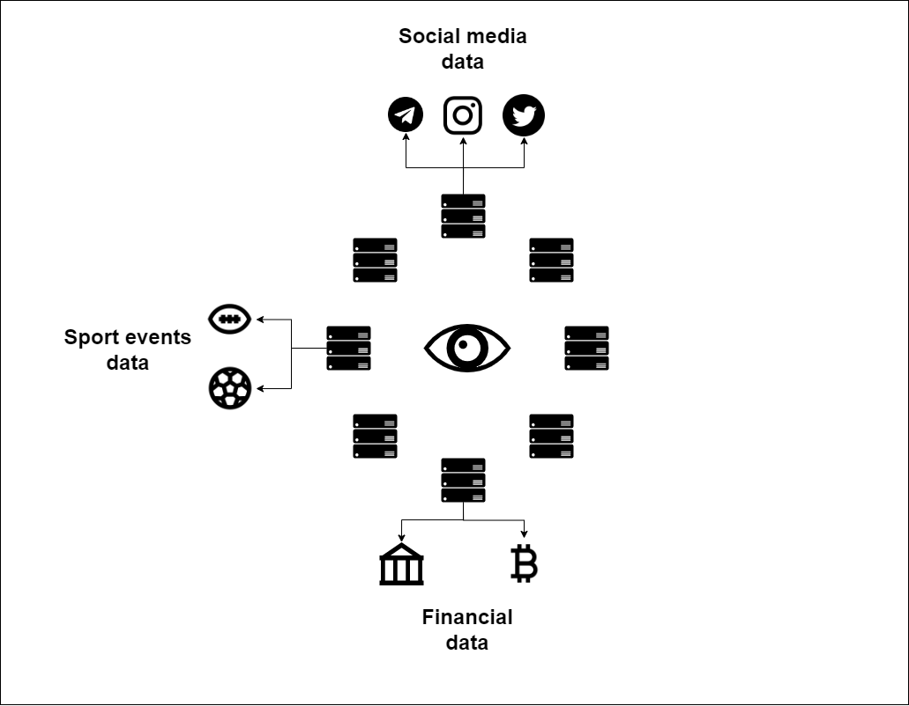

# 💾 Вехи и коммиты

### <mark style="color:red;">Коммиты состояния сервиса</mark>

С одной стороны - сервисы независимы друг от друга, а с другой - именно их взаимодействие и амплифицирует мощь KLYNTAR Services. Для того, чтоб добавить концепции блокчейна в сервисы необходимо чтобы вторые имели единственную цепочку своего развития - то бишь каждый должен иметь возможность проверить историю сервиса и быть уверенным в том, что на протяжении своего существования он работал как честный блокчейн.

Приведу пример, допустим у нас есть какой-то сервис который выполняет роль децентрализованного оффчейн оракула.

Не имея истории и доказательств "работы" этого сервиса, потенциальные пользователи не смогут убедится в его честности и репутации.

Давайте представим, что этим оракулом пользуются другие сервисы и оракул решает солгать

.png>)

Если не будет какого-то источника куда бы оракул "привязывал" свои ответы, то у него не получится накапливать репутацию и другие сервисы не смогут знать о его работе.

### <mark style="color:red;">**Коммиты в симбиоты**</mark>

Благодаря сохранению части данных или коммитов в симбиоты можно будет проследить время жизни и валидность сервиса. Возвращаясь к нашему примеру, если бы оракул время от времени делал коммит хэша корня дерева Меркла в симбиот где листьями дерева были бы хэши его предсказаний, то в таком случае этот второй сервис мог бы убедится, что оракул жертвует своей репутацией, так что доверие к таким данным будет больше ведь доказательство лжи можно предоставить публично(в виде пути от листьев до корня) и таким образом репутация лже-оракула обнулится, его токен обесценится и ничего хорошего не произойдёт.

### <mark style="color:red;">Почему делать коммит именно в симбиот</mark>

Благодаря нашей архитектуре, вы получаете дешёвый и надёжный источник хранения. Кроме того, поскольку и другие сервисы будут делать тоже самое, то ценность симбиота будет расти согласно закону Метклафа про полезность сети.

{% embed url="https://ru.wikipedia.org/wiki/%D0%97%D0%B0%D0%BA%D0%BE%D0%BD_%D0%9C%D0%B5%D1%82%D0%BA%D0%B0%D0%BB%D1%84%D0%B0" %}

### <mark style="color:red;">**Самостоятельность сервиса**</mark>

Сервис(точнее его разработчики) сами решают что им включать в симбиоты, с какой частотой, каким образом каждый может убедиться в их честности и другое. Мы опубликуем более детальную информацию позже.
